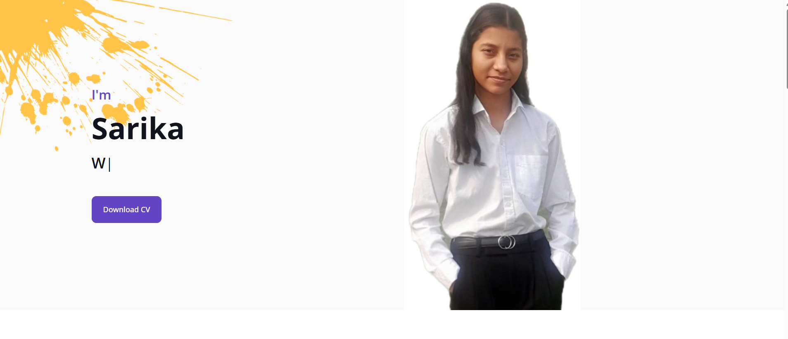
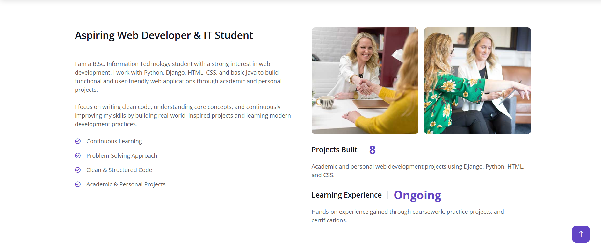
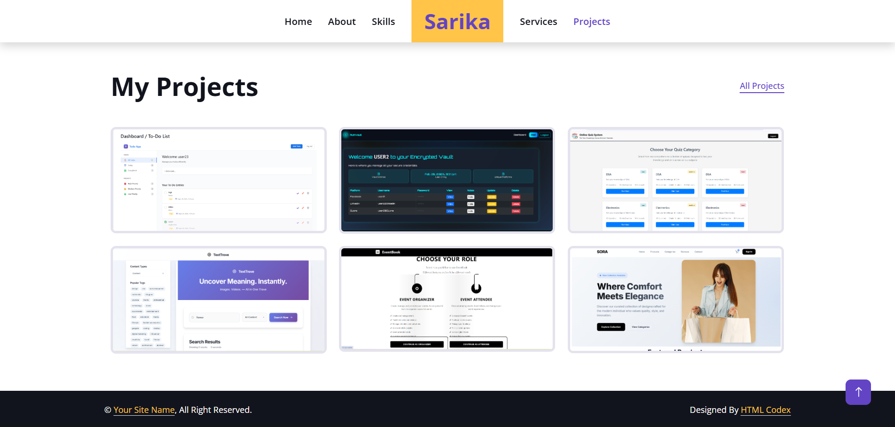

## **Sarika Rana – Personal Portfolio**
About This Project

This is my personal portfolio website built using HTML, CSS, and JavaScript.

## **I used a base template structure and customized it according to my requirements by:**

1.Modifying HTML structure

2.Redesigning sections

3.Updating images and content

4.Customizing styling (CSS)

5.Improving responsiveness

6.Adding my own project details

The final result reflects my design sense and frontend development skills.

##**Live Website**

 https://portfolio-31es.onrender.com/

## **Technologies Used**

1.HTML5

2.CSS3

3.Git

4.GitHub

## **Features**

1.Responsive Design

2.Modern UI Layout

3.About Me Section

4.Skills Section

5.Projects Showcase

## **Screenshots**







## **How to Run Locally**

```bash git clone https://github.com/SarikaRana01/Portfolio-.git
cd Portfolio-
Contact Section
```
